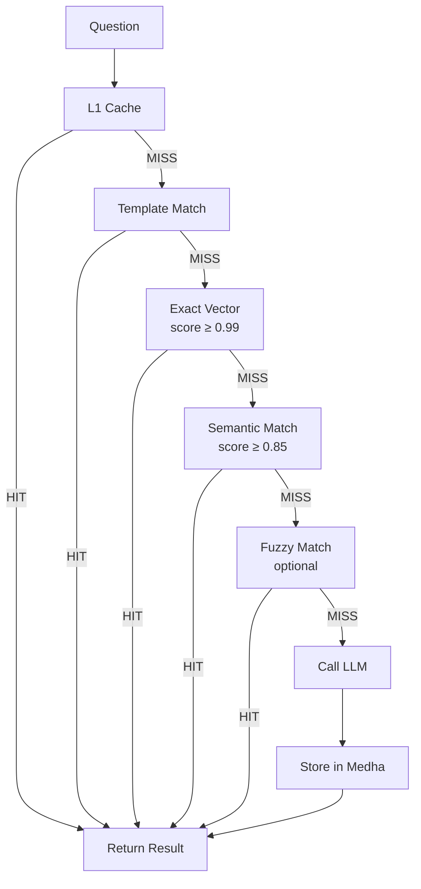

# Medha

> **Stop paying LLMs to answer the same question twice.**

Medha is an async Python semantic cache library for AI Text-to-Query systems. It sits between your application and the LLM, intercepting questions and returning pre-cached SQL, Cypher, or GraphQL queries by matching semantic intent — no LLM call required for repeated patterns.

LLMs regenerate the same structured queries thousands of times per day. Medha intercepts before the LLM call and returns cached results in under a millisecond for repeated patterns. Works with SQL, Cypher, GraphQL, or any structured query language. Drop it in front of any LLM and watch your inference costs drop.

---

## Features

<div class="grid cards" markdown>

-   :material-layers:{ .lg .middle } **Waterfall Search**

    ---

    Five progressive tiers, from sub-millisecond L1 cache to full semantic similarity. Each tier only activates when the previous one misses, keeping average latency minimal.

-   :material-database:{ .lg .middle } **9 Vector Backends**

    ---

    In-memory for development, Qdrant, pgvector, Elasticsearch, VectorChord, Chroma, Weaviate, Redis Stack, Azure AI Search, and LanceDB for production.

-   :material-chip:{ .lg .middle } **4 Embedding Providers**

    ---

    Local ONNX via FastEmbed (no API key, no cost) or cloud providers: OpenAI, Cohere, and Gemini. Swap providers without losing cached data.

-   :material-rocket-launch:{ .lg .middle } **Production Ready**

    ---

    Per-entry TTL, bulk ingestion, pattern and exact invalidation, hit-rate metrics, latency percentiles, and Prometheus-compatible observability.

</div>

---

## Quickstart

```python
import asyncio
from medha import Medha, Settings
from medha.embeddings.fastembed_adapter import FastEmbedAdapter

async def main():
    embedder = FastEmbedAdapter()  # local ONNX, no API key
    settings = Settings(backend_type="memory")

    async with Medha("demo", embedder=embedder, settings=settings) as cache:
        await cache.store(
            "How many active users do we have?",
            "SELECT COUNT(*) FROM users WHERE active = true",
        )

        hit = await cache.search("Count of active users")
        print(hit.generated_query)   # SELECT COUNT(*) FROM users WHERE active = true
        print(hit.strategy)          # SearchStrategy.SEMANTIC_MATCH
        print(f"Confidence: {hit.confidence:.0%}")  # e.g. Confidence: 94%

asyncio.run(main())
```

---

## Architecture

Medha uses a five-tier waterfall search. Each tier is only reached when the previous one misses:



---

!!! tip "Performance"

    The hit rate is defined as:

    $$\text{hit\_rate} = \frac{\text{total\_hits}}{\text{total\_hits} + \text{total\_misses}}$$

    Even a 50% hit rate halves LLM costs for repetitive query workloads. In practice, production Text-to-Query systems see hit rates of 70–90% because users repeatedly ask structurally equivalent questions.

---

## Installation

```bash
pip install medha-archai
```

See [Getting Started](getting_started.md) for installation options, environment variables, and a full walkthrough.
