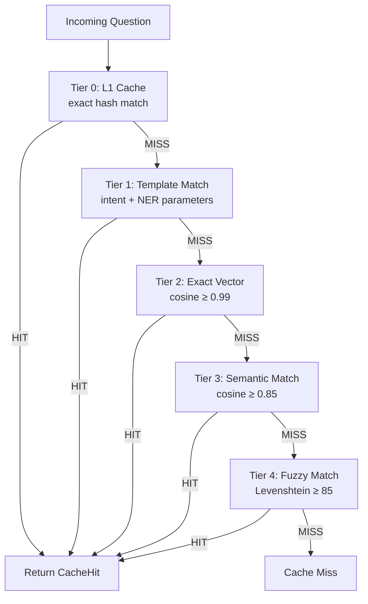
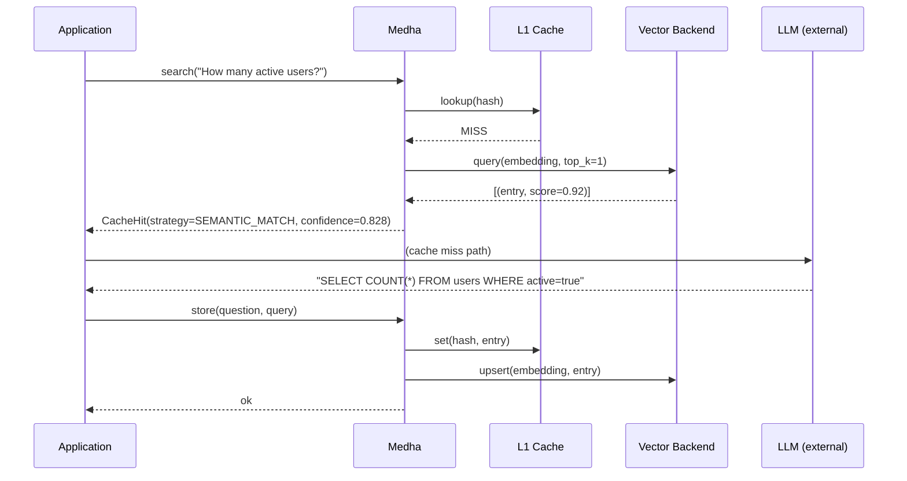

# Core Concepts

---

## The Semantic Cache

Traditional caches work on exact key matches. A semantic cache works on *meaning*. Two questions that are phrased differently but mean the same thing — "How many active users do we have?" and "Count of active users" — should return the same cached SQL query.

Medha solves a specific problem: LLM-backed Text-to-Query systems spend most of their inference budget regenerating structurally identical queries. Once a question has been translated to SQL (or Cypher or GraphQL), repeating that translation is pure waste. Medha stores the question embedding and its resulting query, and short-circuits the LLM for any semantically equivalent future question.

The value proposition is direct: lower latency, lower cost, and deterministic query output for common patterns.

---

## Waterfall Search

Medha evaluates every incoming question through five tiers in sequence, stopping at the first match:

| Tier | Strategy | Trigger | Typical Latency | Confidence |
|---|---|---|---|---|
| 0 | L1 Cache | Exact hash match on normalized text | < 0.1 ms | 1.0 |
| 1 | Template Match | Intent match + NER parameter extraction | 1–5 ms | 0.9–1.0 |
| 2 | Exact Vector | Cosine similarity ≥ 0.99 | 5–20 ms | 0.99 |
| 3 | Semantic | Cosine similarity ≥ 0.85 | 5–20 ms | score × 0.9 |
| 4 | Fuzzy | Levenshtein distance ratio ≥ 85 | 20–50 ms | varies |

Tier 4 (Fuzzy) is optional and disabled by default. Enable it in `Settings` when your user base uses highly inconsistent spelling or phrasing.

---

## Scoring Model

### Cosine Similarity

All vector tiers use cosine similarity to compare the incoming question embedding against stored embeddings:

$$\text{cosine}(\vec{q}, \vec{e}) = \frac{\vec{q} \cdot \vec{e}}{\|\vec{q}\| \|\vec{e}\|}$$

The result is in the range `[−1, 1]`, where `1.0` means identical direction (semantically equivalent questions). In practice, all scores are in `[0, 1]` because sentence embeddings are non-negative.

### Semantic Confidence Penalty

When Tier 3 (Semantic Match) fires, the raw cosine score is penalized to reflect that the match is not exact:

$$\text{confidence}_{\text{semantic}} = \cos(\vec{q}, \vec{e}) \times 0.9$$

This ensures that `CacheHit.confidence` from a semantic match is always strictly below a confidence from an exact vector match, giving downstream consumers a clear quality signal.

---

## Data Flow

---

## Key Types

| Type | Description |
|---|---|
| `CacheHit` | Returned on a successful search; contains `generated_query`, `strategy`, `confidence`, `response_summary` |
| `SearchStrategy` | Enum: `L1_CACHE`, `TEMPLATE_MATCH`, `EXACT_VECTOR_MATCH`, `SEMANTIC_MATCH`, `FUZZY_MATCH` |
| `QueryTemplate` | A parameterised question pattern with named slots (e.g. `{city}`, `{date_range}`) |
| `CacheEntry` | The stored record: question text, embedding, query, optional TTL |
| `CacheStats` | Aggregate statistics: `total_hits`, `total_misses`, `hit_rate`, per-strategy breakdown |

See the [Types API reference](../api/types.md) for full field definitions.
