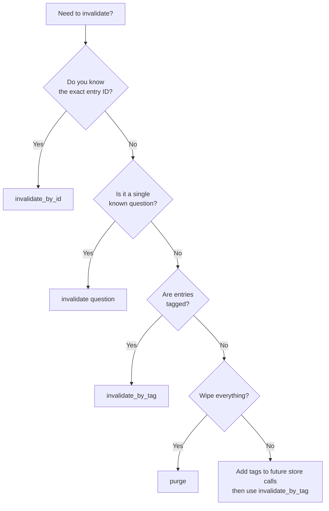

# Invalidation

Invalidation permanently removes entries from the cache. Use it when the underlying schema changes, a query is known to be incorrect, or a business rule changes that affects stored results.

!!! warning "Invalidation is permanent"

    There is no undo. Once an entry is invalidated, it is deleted from the vector backend and cannot be recovered. If you need soft-delete behaviour, use TTL instead.

---

## Invalidation Methods

### 1. By Entry ID

Remove a specific entry by its unique ID, as returned by `store()`:

```python
async with Medha("demo", embedder=embedder, settings=settings) as cache:
    entry_id = await cache.store(
        "How many users?",
        "SELECT COUNT(*) FROM users",
    )

    await cache.invalidate_by_id(entry_id)
```

Use this when you know exactly which entry needs to be removed.

---

### 2. By Question

Remove the entry whose stored question exactly matches the provided text (after normalization):

```python
async with Medha("demo", embedder=embedder, settings=settings) as cache:
    await cache.invalidate("How many users?")
```

This performs an exact normalized-text match, not a semantic search. The question must match verbatim (modulo normalization) to the question used at store time.

---

### 3. By Tag

Remove all entries that carry a specific tag. This is the recommended approach for bulk invalidation after schema changes:

```python
async with Medha("demo", embedder=embedder, settings=settings) as cache:
    # Store entries with tags
    await cache.store(
        "How many active users?",
        "SELECT COUNT(*) FROM users WHERE active = true",
        tags=["users", "aggregation"],
    )
    await cache.store(
        "List all users",
        "SELECT * FROM users",
        tags=["users"],
    )

    # Invalidate everything tagged "users"
    deleted = await cache.invalidate_by_tag("users")
    print(f"Deleted {deleted} entries")
```

---

### 4. Purge All

Remove every entry in a collection. Use with caution — this wipes the entire cache namespace:

```python
async with Medha("demo", embedder=embedder, settings=settings) as cache:
    await cache.purge()
```

`purge()` is equivalent to dropping and recreating the collection in the vector backend.

---

## Decision Tree



!!! tip "Tag your entries"

    The most maintainable invalidation strategy is to tag entries by domain (`"users"`, `"orders"`, `"inventory"`) or schema version (`"schema_v2"`). When a table changes, a single `invalidate_by_tag` call removes all affected queries.
