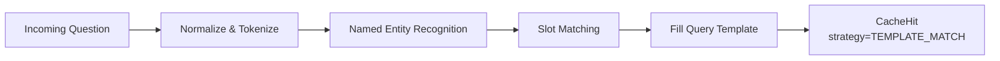

# Templates

Query templates let Medha match questions with variable slots — "Sales in {city} for {date_range}" — and fill in parameters extracted from the user's natural-language question. This is Tier 1 of the waterfall search.

---

## `QueryTemplate` Field Reference

| Field | Type | Required | Description |
|---|---|---|---|
| `template_text` | `str` | Yes | The question pattern with `{slot}` placeholders |
| `generated_query` | `str` | Yes | The query to return when this template matches |
| `intent` | `str` | Yes | Short label identifying the query intent (e.g. `"sales_by_region"`) |
| `parameters` | `dict[str, str]` | No | Default or example values for each slot |
| `response_summary` | `str` | No | Human-readable description of the query result |
| `tags` | `list[str]` | No | Arbitrary tags for filtering and invalidation |

---

## Template Syntax

Slots are defined with curly braces: `{slot_name}`. During matching, Medha extracts named entities from the incoming question and substitutes them into the stored query.

```python
from medha.types import QueryTemplate

template = QueryTemplate(
    template_text="What were the sales in {city} during {date_range}?",
    generated_query=(
        "SELECT SUM(amount) FROM sales "
        "WHERE city = '{city}' AND sale_date BETWEEN {date_range}"
    ),
    intent="sales_by_region",
)
```

Slots can also use regular expression patterns for more precise extraction. Define these in the `parameters` dict:

```python
template = QueryTemplate(
    template_text="Show me orders from {customer} in the last {n} days",
    generated_query=(
        "SELECT * FROM orders WHERE customer_name = '{customer}' "
        "AND created_at >= NOW() - INTERVAL '{n} days'"
    ),
    intent="orders_by_customer",
    parameters={
        "customer": r"[A-Za-z\s]+",
        "n": r"\d+",
    },
)
```

---

## Loading Templates from File

Templates can be pre-loaded from a JSON or YAML file using `warm_from_file` or by passing a list to `Medha`:

=== "JSON"

    ```json
    [
      {
        "template_text": "What were the sales in {city} during {date_range}?",
        "generated_query": "SELECT SUM(amount) FROM sales WHERE city = '{city}'",
        "intent": "sales_by_region"
      },
      {
        "template_text": "How many {status} orders do we have?",
        "generated_query": "SELECT COUNT(*) FROM orders WHERE status = '{status}'",
        "intent": "order_count_by_status"
      }
    ]
    ```

=== "YAML"

    ```yaml
    - template_text: "What were the sales in {city} during {date_range}?"
      generated_query: "SELECT SUM(amount) FROM sales WHERE city = '{city}'"
      intent: sales_by_region

    - template_text: "How many {status} orders do we have?"
      generated_query: "SELECT COUNT(*) FROM orders WHERE status = '{status}'"
      intent: order_count_by_status
    ```

```python
from medha import Medha, Settings
from medha.embeddings.fastembed_adapter import FastEmbedAdapter

async with Medha(
    "demo",
    embedder=FastEmbedAdapter(),
    settings=Settings(),
    templates_file="templates.json",
) as cache:
    ...
```

---

## Scoring Formula

Template matching combines keyword overlap with cosine similarity between the incoming question and the template text:

$$\text{score} = \alpha \cdot \text{keyword\_overlap} + (1 - \alpha) \cdot \cos(\vec{q}, \vec{t})$$

where:
- $\alpha$ is a weighting factor (default `0.3`)
- $\text{keyword\_overlap}$ is the Jaccard similarity of stemmed tokens
- $\cos(\vec{q}, \vec{t})$ is the cosine similarity between the question embedding and the template embedding

A template match fires when its combined score exceeds `score_threshold_template` (default `0.9`).

---

## Parameter Extraction Pipeline



The extraction pipeline:
1. Normalizes the input (lowercase, strip punctuation)
2. Runs NER to identify entities (cities, dates, numbers, product names)
3. Maps extracted entities to template slots by type and position
4. Substitutes values into the `generated_query` string

---

## Worked Example: Sales by Region

Define a template covering the common "sales by region" pattern:

```python
from medha.types import QueryTemplate

sales_template = QueryTemplate(
    template_text="What were total sales in {city}?",
    generated_query=(
        "SELECT SUM(amount) AS total_sales\n"
        "FROM sales\n"
        "WHERE region_name = '{city}'\n"
        "GROUP BY region_name;"
    ),
    intent="sales_by_region",
    response_summary="Total sales amount grouped by city/region",
    tags=["sales", "regional", "aggregation"],
)
```

At search time, all of the following questions will match this template and return the same parameterised query:

| Question | Extracted `{city}` |
|---|---|
| "What were total sales in Rome?" | `Rome` |
| "Show total sales in New York" | `New York` |
| "How much did we sell in Tokyo?" | `Tokyo` |

The confidence will be in the `0.9–1.0` range, reflecting the template-match tier.
