# TTL & Lifecycle

Medha supports time-to-live (TTL) for cache entries. Entries past their TTL are invisible to search and eligible for removal by the background cleanup task.

---

## Per-Entry TTL

Pass a `ttl_seconds` argument to `store()` to override the global default for a single entry:

```python
async with Medha("demo", embedder=embedder, settings=settings) as cache:
    # This entry expires after 1 hour
    await cache.store(
        question="What is the current stock price of ACME?",
        generated_query="SELECT price FROM stocks WHERE symbol = 'ACME' ORDER BY ts DESC LIMIT 1",
        ttl_seconds=3600,
    )

    # This entry never expires (overrides a non-None global default)
    await cache.store(
        question="What is the schema of the users table?",
        generated_query="SELECT column_name, data_type FROM information_schema.columns WHERE table_name = 'users'",
        ttl_seconds=None,
    )
```

---

## Global Default TTL

Set `default_ttl_seconds` in `Settings` to apply a TTL to every entry that does not explicitly override it:

```python
from medha import Settings

settings = Settings(
    backend_type="qdrant",
    default_ttl_seconds=86400,  # 24 hours
)
```

Entries stored without an explicit `ttl_seconds` will inherit this value. Set to `None` (the default) for no expiry.

---

## Background Cleanup

When `enable_background_cleanup=True` (the default), Medha runs a background asyncio task that sweeps the vector backend for expired entries at a configurable interval:

```python
settings = Settings(
    enable_background_cleanup=True,
    cleanup_interval_seconds=300,  # sweep every 5 minutes
)
```

The cleanup task starts when you enter the async context manager and stops when you exit it. It does not block searches.

---

## Manual Expiry

Call `expire()` to immediately mark a specific entry as expired without waiting for the cleanup task:

```python
async with Medha("demo", embedder=embedder, settings=settings) as cache:
    entry_id = await cache.store("How many users?", "SELECT COUNT(*) FROM users")

    # Immediately expire this entry
    await cache.expire(entry_id)

    # Now search returns None
    hit = await cache.search("How many users?")
    assert hit is None
```

---

## Entry Lifecycle

```mermaid
gantt
    title Cache Entry Lifecycle
    dateFormat  s
    axisFormat  %S s

    section Entry
    Stored              : milestone, m1, 0, 0s
    Active (searchable) : active, 0, 60s
    TTL expires         : milestone, m2, 60, 0s
    Invisible to search : crit, 60, 90s
    Background cleanup  : milestone, m3, 90, 0s
    Deleted from backend: done, 90, 100s
```



| Phase | Description |
|---|---|
| **Active** | Entry is stored and returned by searches |
| **Expired** | TTL has passed; entry is hidden from search results but not yet deleted |
| **Deleted** | Background cleanup has physically removed the entry from the backend |

!!! note

    The window between expiry and deletion depends on `cleanup_interval_seconds`. During this window, the entry counts as a miss in search, but storage is still consumed. Reduce the interval if storage efficiency is critical.
